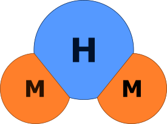

# md2html

CLI Markdown to HTML converter.

# Motivation

This tool was initially conceived and implemented as a simple way of keeping notes on study
courses, then evolved into a more flexible and powerful solution.

# Implementation

There are two implementations: in Python and in Java. They work mostly the same way, have the
same command line syntax, process the same input, are shipped together as source code and share
some common artifacts like templates, scripts, and this documentation. Though the versions are not
interdependent and can be used separately.

Under the hood, these implementations use existing libraries for Markdown-to-HTML conversion.
See the complete documentation for more details.

# Installation

The Python version is provided ready to use though it needs Python 3 and some Python packages to
be installed. Java version is provided in source code; the executable artifact is provided
separately as a release build, or prepared persons may build it themselves. The common
installation sequence is:

- Place (or clone from the VCS) directory `md2html` wherever you like.
- Define `MD2HTML_HOME` environment variable as the absolute path of directory `md2html`.
- See more instructions [here](https://arctrong.github.io/md2html/readme.html).

# More info

The complete documentation is created using this utility and can be viewed
[here](https://arctrong.github.io/md2html/readme.html).
