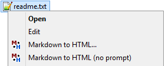

# md2html


CLI Markdown to HTML converter.

# Motivation

This tool was initially conceived and implemented as a simple way of keeping notes on study
courses, then evolved into a more flexible and powerful solution.

# What is inside

The executables are provided along with templates that must be suitable for most documentation
tasks and scripts for integration and bulk processing.

# Implementation

There are two implementations: in Python and in Java. They work mostly the same way, have the
same command line syntax, process the same input, are shipped together as source code and share
some common artifacts like templates, scripts, and documentation. Though the versions are not
interdependent and can be used separately.

Under the hood, these implementations use existing libraries for Markdown-to-HTML conversion.
See the complete documentation for more details.

# Installation

The Python version is provided ready to use though it needs Python 3 and some Python packages to
be installed. Java version is provided in source code; the executable artifact is provided
separately as a release build, or prepared persons may build it themselves. The common
installation sequence is:

- Place (or clone from the VCS) directory `md2html` wherever you like.
- Define `MD2HTML_HOME` environment variable as the absolute path of directory `md2html`.
- See more instructions [here](https://arctrong.github.io/md2html/readme.html).

# Usage

A simple usage example for the Python version is:

````
>python %MD2HTML_HOME%/python/md2html.py -i test.txt
````

This will convert file `test.txt` into file `test.html` using default parameters. The Java version
usage is similar. With bulk processing scripts, create a *list file* like this:

````
-i doc_src/index.md -o doc/index.html --title "My greatest home page"
-i doc_src/about.md -o doc/about.html
````

Then run

````
>generate_html.bat
````

Also there are a script and instructions for integration into Windows Explorer context menu:



See the complete documentation for more details.

# On Linux

The Java and the Python executables are platform-independent so they work on Linux. The bulk
processing scripts are also provided in *Bash shell* syntax. The file explorer integration script
is not yet ported but it may be dependent on the desktop environment and is quite straightforward,
so prepared Linux users may port the existing `bin/context_menu/md2html_prompt.bat` script
themselves.

# More info

The complete documentation is created using this utility and can be viewed
[here](https://arctrong.github.io/md2html/readme.html).
